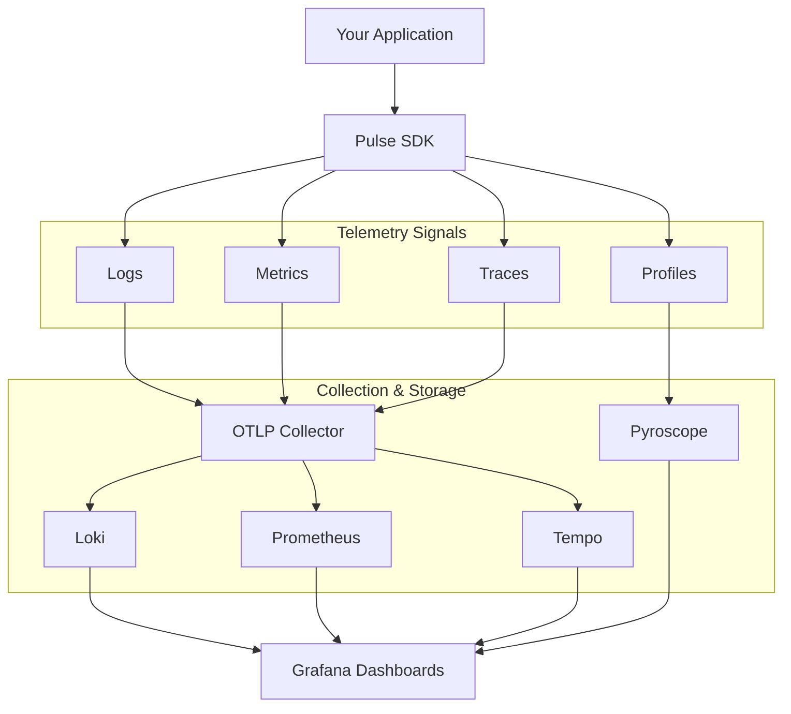

# Pulse [](https://buildkite.com/machanirobotics/pulse) [](https://codecov.io/gh/machanirobotics/pulse)

<div align="center">
  
  <h3>Unified Observability Framework</h3>
  <p>Production-grade logging, metrics, tracing, and profiling for modern applications</p>
</div>

---

## Overview

**Pulse** is a comprehensive observability framework that provides unified telemetry for your applications. Built on OpenTelemetry standards, Pulse makes it easy to instrument your code with structured logging, distributed tracing, metrics collection, and continuous profiling.

Pulse is now open-sourced by **Machani Robotics** to help teams build observable, maintainable systems.

## Features

- **Structured Logging** - Context-aware logging with automatic trace correlation
- **Metrics Collection** - Counters, histograms, and gauges with OpenTelemetry
- **Distributed Tracing** - End-to-end request tracking across services
- **Continuous Profiling** - Production performance analysis with Pyroscope
- **MCAP Recording** - Offline analysis with Foxglove Studio
- **Zero-Config Integration** - Works out of the box with sensible defaults
- **OpenTelemetry Native** - Standard protocols for maximum compatibility

## Quick Start

### Go SDK

Get started with Pulse in your Go applications:

```bash
go get github.com/machanirobotics/pulse/go
```

```go
import (
    "context"
    pulse "github.com/machanirobotics/pulse/go"
    "github.com/machanirobotics/pulse/go/options"
)

func main() {
    ctx := context.Background()
    
    // Initialize Pulse
    p, err := pulse.New(ctx, options.ServiceOptions{
        Name:        "my-service",
        Version:     "1.0.0",
        Environment: options.Production,
    }, options.PulseOptions{
        Telemetry: options.TelemetryOptions{
            Logging: options.LoggingTelemetryOptions{Enabled: true},
            Metrics: options.MetricsTelemetryOptions{Enabled: true},
            Tracing: options.TracingTelemetryOptions{Enabled: true},
        },
    })
    if err != nil {
        panic(err)
    }
    defer p.Close(ctx)
    
    // Use it!
    p.Logger.Info("Service started", nil)
}
```

**[📖 Full Go SDK Documentation →](go/README.md)**

## Observability Stack

Pulse includes a complete, pre-configured observability stack powered by industry-standard tools:

- **Loki** - Log aggregation
- **Tempo** - Distributed tracing
- **Prometheus** - Metrics storage
- **Pyroscope** - Continuous profiling
- **Grafana** - Unified dashboards
- **OpenTelemetry Collector** - Telemetry pipeline

### Running the Stack

```bash
cd otel
docker compose up -d
```

Access Grafana at `http://localhost:3000` with all datasources pre-configured.

**[📖 OpenTelemetry Stack Documentation →](otel/README.md)**

## Architecture



## Language Support

| Language | Status | Documentation |
|----------|--------|---------------|
| Go       | ✅ Stable | [go/README.md](go/README.md) |
| Python   | 🚧 Coming Soon | - |
| Rust     | 🚧 Coming Soon | - |

## Use Cases

- **Microservices** - Track requests across service boundaries
- **API Services** - Monitor performance and errors
- **Robotics** - Record and analyze system behavior
- **ML Pipelines** - Trace data processing workflows
- **Production Debugging** - Correlate logs, traces, and metrics

## Contributing

We welcome contributions! Pulse is open-source and maintained by Machani Robotics.

1. Fork the repository
2. Create a feature branch
3. Make your changes
4. Submit a pull request

## License

Copyright © 2025 Machani Robotics

Licensed under the Apache License, Version 2.0. See [LICENSE](LICENSE) for details.

---
<strong>Built with ❤️ by Machani Robotics</strong>
| Open Source Observability for Everyone
>>>>>>> 4e6a912 (chore: migrate from Bazel to Go modules and update CI infrastructure)
