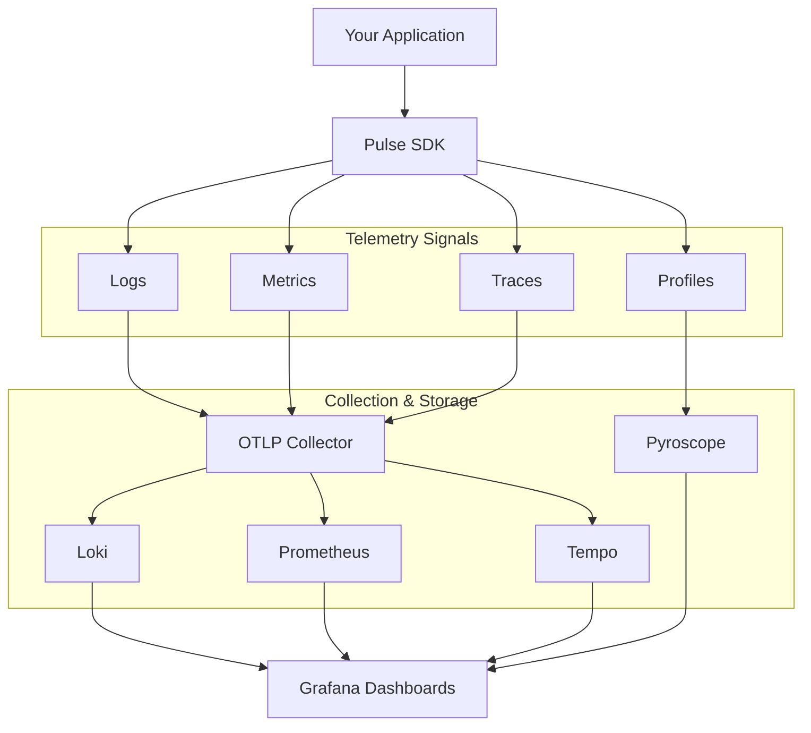

# Pulse v1.0.0 - Initial Open Source Release

**Release Date:** November 9, 2025  
**License:** Apache 2.0  
**Maintainer:** Machani Robotics

---

## 🎉 Overview

We're excited to announce the initial open source release of **Pulse**, a comprehensive observability framework that provides unified telemetry for modern applications. Built on OpenTelemetry standards, Pulse makes it easy to instrument your code with structured logging, distributed tracing, metrics collection, and continuous profiling.

## 🚀 What's New

### Language SDKs

#### Go SDK
- **Complete Go implementation** with OpenTelemetry integration
- Structured logging with automatic trace correlation
- Metrics collection (counters, histograms, gauges)
- Distributed tracing with span management
- Continuous profiling with Pyroscope integration
- MCAP recording for offline analysis with Foxglove Studio
- Comprehensive examples for all features

#### Rust SDK
- **Production-ready Rust implementation**
- OTLP logging and stdout support
- Distributed tracing capabilities
- Metrics recording with macros
- Module-level filtering
- Nix flake support for reproducible builds
- Bazel build integration

### Observability Stack

#### Complete Docker Compose Stack
- **Loki** - Log aggregation system (port 3100)
- **Tempo** - Distributed tracing backend (port 3200)
- **Prometheus** - Metrics collection and storage (port 9090)
- **Pyroscope** - Continuous profiling platform (port 4040)
- **OpenTelemetry Collector** - Telemetry data pipeline (ports 4317/4318)
- **Grafana** - Unified observability dashboard (port 3000)

#### Pre-configured Dashboards
- Logging dashboard with trace correlation
- Metrics visualization dashboard
- Distributed tracing dashboard
- Continuous profiling dashboard

### Developer Experience

#### CI/CD Workflows
- **Continuous Integration** - Go SDK testing on Ubuntu and macOS
- **Code Coverage** - Automated coverage reporting with Codecov
- **Linting** - Go, Markdown, and YAML linting
- **Docker Compose Validation** - Stack health checks

#### Documentation
- Comprehensive main README with architecture diagrams
- Detailed Go SDK documentation with examples
- OpenTelemetry stack setup guide
- Issue templates for bugs, features, and chores
- Contributing guidelines

## 📦 Installation

### Go SDK

```bash
go get github.com/machanirobotics/pulse/go/
```

### Observability Stack

```bash
cd otel
docker compose up -d
```

Access Grafana at `http://localhost:3000` with all datasources pre-configured.

## ✨ Key Features

- **🔍 Structured Logging** - Context-aware logging with automatic trace correlation
- **📊 Metrics Collection** - Counters, histograms, and gauges with OpenTelemetry
- **🔗 Distributed Tracing** - End-to-end request tracking across services
- **⚡ Continuous Profiling** - Production performance analysis with Pyroscope
- **📦 MCAP Recording** - Offline analysis with Foxglove Studio
- **🎯 Zero-Config Integration** - Works out of the box with sensible defaults
- **🔌 OpenTelemetry Native** - Standard protocols for maximum compatibility

## 📝 Detailed Changes

### Commit History

#### `ca553f0` - Initial Commit
- Clean starting point for Pulse open source release

#### `a836155` - Pulse Rust (#7) by Shyamant Achar
**Added:**
- Rust SDK foundation with OTLP integration
- Logger with stdout and OTLP support
- Formatted logging output
- Bazel build configuration
- Feature flags for conditional compilation
- Example implementations

**Files Changed:** 31 files, 22,899 insertions

#### `efefcae` - Rust Revamp (#11) by Aditya Jindal
**Added:**
- Enhanced Rust implementation with improved architecture
- Metrics recording with declarative macros
- Advanced tracing with procedural macro support
- Module-level filtering for logs
- Configuration deserialization from TOML
- Nix flake for reproducible development environment
- Default values for service name and version
- Comprehensive documentation strings

**Updated:**
- Rust toolchain configuration
- Cargo dependencies and build system
- Example applications with better demonstrations

**Removed:**
- Buildkite CI/CD (replaced with GitHub Actions)
- Outdated linting configurations

**Files Changed:** 57 files, 9,338 insertions, 11,642 deletions

#### `9d723a4` - Migrate from Bazel to Go Modules
**Migration:**
- Removed Bazel build system entirely
- Migrated to Go modules for dependency management
- Simplified build process for Go SDK

**Added:**
- Complete Go SDK implementation
  - `go/internal/logging/` - Logging with OTLP and MCAP support
  - `go/internal/metrics/` - Metrics collection
  - `go/internal/tracing/` - Distributed tracing
  - `go/internal/profiling/` - Continuous profiling
  - `go/internal/telemetry/` - Unified telemetry client
  - `go/internal/foxglove/` - MCAP recording
- Five comprehensive examples:
  - Logging example with multilingual support
  - Metrics collection example
  - Distributed tracing example
  - Profiling example
  - MCAP recording example
- GitHub Actions workflows:
  - CI workflow for testing across platforms
  - Coverage workflow with Codecov integration
  - Linting workflow for Go, Markdown, and YAML
- OpenTelemetry stack:
  - Docker Compose configuration
  - Grafana dashboards (logging, metrics, tracing, profiling)
  - Pre-configured datasources
  - Service configurations (Loki, Tempo, Prometheus, Pyroscope)

**Updated:**
- Project structure for better organization
- Documentation with comprehensive guides
- Issue templates for better bug reporting

**Removed:**
- All Bazel configuration files
- Old CI/CD configurations
- Legacy build scripts

**Files Changed:** 66 files, 9,773 insertions, 409 deletions

#### `dcce71e` - Rebrand to Pulse
**Updated:**
- All README files with Pulse branding
- Removed all "Kodo" references
- Updated LICENSE to 2025
- Enhanced contributing guidelines
- Cleaned up issue templates
- Fixed GitHub workflows for Go SDK
- Added proper Machani Robotics attribution

**Files Changed:** 2 files, 3 insertions, 122 deletions

#### `5e44353` - Documentation Polish
**Updated:**
- Removed BuildKite build status badge
- Updated logo path to `.assets/` directory
- Cleaned up MODULE.bazel.lock

**Files Changed:** 3 files, 2 insertions, 2,472 deletions

#### `2b98859`, `e663b1a`, `91c1362` - README Refinements
**Updated:**
- Minor README formatting improvements
- Removed redundant sections
- Polished documentation

## 🏗️ Architecture



## 🎯 Use Cases

- **Microservices** - Track requests across service boundaries
- **API Services** - Monitor performance and errors
- **Robotics** - Record and analyze system behavior
- **ML Pipelines** - Trace data processing workflows
- **Production Debugging** - Correlate logs, traces, and metrics

## 📚 Examples

### Go SDK - Basic Usage

```go
package main

import (
    "context"
    "github.com/machanirobotics/pulse/go/"
    "github.com/machanirobotics/pulse/go/options"
)

func main() {
    ctx := context.Background()
    
    // Initialize Pulse
    p, err := pulse.New(ctx, options.ServiceOptions{
        Name:        "my-service",
        Version:     "1.0.0",
        Environment: options.Production,
    }, options.PulseOptions{
        Telemetry: options.TelemetryOptions{
            Logging: options.LoggingTelemetryOptions{Enabled: true},
            Metrics: options.MetricsTelemetryOptions{Enabled: true},
            Tracing: options.TracingTelemetryOptions{Enabled: true},
        },
    })
    if err != nil {
        panic(err)
    }
    defer p.Close(ctx)
    
    // Use it!
    p.Logger.Info("Service started", nil)
}
```

### Distributed Tracing

```go
func processOrder(ctx context.Context, p *pulse.Pulse) error {
    return p.Tracing.Trace(ctx, "ProcessOrder", nil, func(ctx context.Context, span *pulse.Span) error {
        span.AddEvent("Processing started")
        
        // Your business logic here
        
        span.AddEvent("Processing completed")
        span.SetOK()
        return nil
    })
}
```

## 🤝 Contributors

- **Shyamant Achar** - Rust SDK foundation and architecture
- **Aditya Jindal** - Rust SDK enhancements and metrics
- **Srikanth Kandarpa** - Go SDK, migration, and open source preparation

## 📄 License

Copyright © 2025 Machani Robotics

Licensed under the Apache License, Version 2.0. See [LICENSE](LICENSE) for details.

## 🔗 Links

- **Repository:** https://github.com/machanirobotics/pulse
- **Documentation:** [README.md](README.md)
- **Go SDK Docs:** [go/README.md](go/README.md)
- **OpenTelemetry Stack:** [otel/README.md](otel/README.md)
- **Issue Tracker:** https://github.com/machanirobotics/pulse/issues

## 🚦 Getting Started

1. **Install the Go SDK:**
   ```bash
   go get github.com/machanirobotics/pulse/go/
   ```

2. **Start the observability stack:**
   ```bash
   cd otel
   docker compose up -d
   ```

3. **Access Grafana:**
   Open http://localhost:3000 in your browser

4. **Run an example:**
   ```bash
   cd go/examples/logging
   go run main.go
   ```

5. **View your telemetry in Grafana!**

## 🎊 What's Next

We're excited to continue developing Pulse with the open source community. Upcoming features include:

- Python SDK
- Additional language support (Rust improvements)
- More pre-built dashboards
- Enhanced MCAP integration
- Performance optimizations
- Extended documentation and tutorials

## 💬 Community

We welcome contributions! Please see our [contributing guidelines](.github/CONTRIBUTING.md) and feel free to:

- Report bugs via [GitHub Issues](https://github.com/machanirobotics/pulse/issues)
- Submit feature requests
- Contribute code via Pull Requests
- Improve documentation
- Share your use cases

---

**Built with ❤️ by Machani Robotics**  
*Open Source Observability for Everyone*
