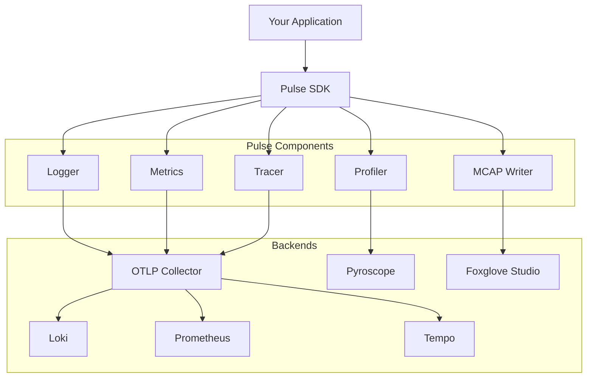
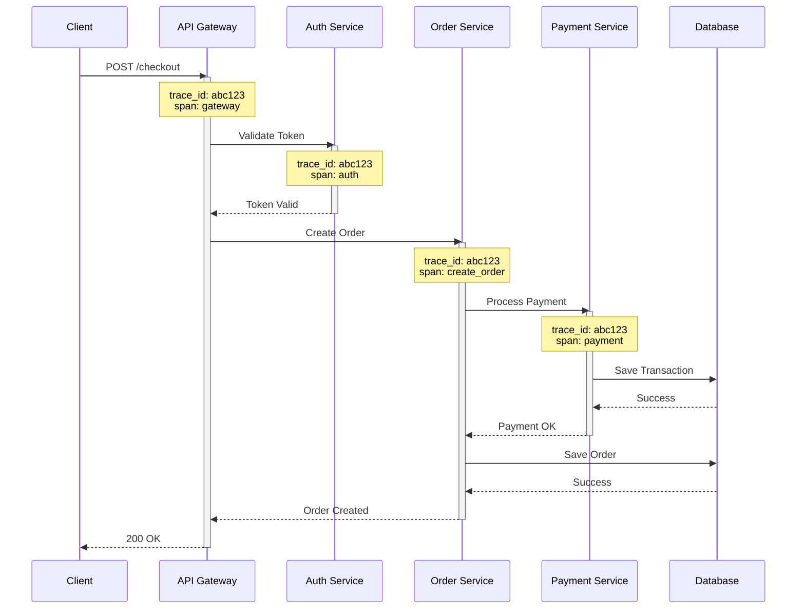

# Pulse - Go SDK

A comprehensive observability framework for Go applications, providing unified logging, metrics, tracing, and profiling capabilities with OpenTelemetry integration.

## Table of Contents

- [Installation](#installation)
- [Quick Start](#quick-start)
- [Architecture](#architecture)
- [Features](#features)
  - [Logging](#logging)
  - [Metrics](#metrics)
  - [Distributed Tracing](#distributed-tracing)
  - [Profiling](#profiling)
  - [MCAP Recording](#mcap-recording)
- [Configuration](#configuration)
- [Examples](#examples)
- [Best Practices](#best-practices)

## Installation

Install the Pulse SDK using Go modules:

```bash
go get github.com/machanirobotics/pulse/go/
```

**Requirements:**

- Go 1.25.0 or higher
- OpenTelemetry Collector (optional, for production deployments)

## Quick Start

```go
package main

import (
    "context"
    "github.com/machanirobotics/pulse/go/"
    "github.com/machanirobotics/pulse/gooptions"
)

func main() {
    ctx := context.Background()

    // Initialize Pulse with service information
    p, err := pulse.New(ctx, options.ServiceOptions{
        Name:        "my-service",
        Description: "My awesome service",
        Version:     "1.0.0",
        Environment: options.Production,
    }, options.PulseOptions{
        Telemetry: options.TelemetryOptions{
            Logging: options.LoggingTelemetryOptions{Enabled: true},
            Metrics: options.MetricsTelemetryOptions{Enabled: true},
            Tracing: options.TracingTelemetryOptions{Enabled: true},
            OTLP: options.OTLPOptions{
                Host:    "localhost",
                Port:    4317,
                Enabled: true,
            },
        },
    })
    if err != nil {
        panic(err)
    }
    defer p.Close(ctx)

    // Use logging, metrics, and tracing
    p.Logger.Info("Service started", nil)
}
```

## Architecture

Pulse provides a unified observability stack built on OpenTelemetry standards:



## Features

### Logging

Pulse provides structured logging with automatic context propagation and OpenTelemetry integration.

#### Basic Logging

```go
// Info level
p.Logger.Info("User logged in", map[string]interface{}{
    "user_id": "12345",
    "ip":      "192.168.1.1",
})

// Warning level
p.Logger.Warn("Rate limit approaching", map[string]interface{}{
    "current": 95,
    "limit":   100,
})

// Error level
err := processRequest()
if err != nil {
    p.Logger.Error("Request processing failed", map[string]interface{}{
        "error":      err.Error(),
        "request_id": "req-123",
    })
}

// Debug level
p.Logger.Debug("Cache hit", map[string]interface{}{
    "key": "user:12345",
    "ttl": 3600,
})
```

#### Structured Attributes

Use structured attributes for better queryability:

```go
p.Logger.Info("Payment processed", map[string]interface{}{
    "transaction_id": "txn-789",
    "amount":         99.99,
    "currency":       "USD",
    "user_id":        "user-456",
    "payment_method": "credit_card",
    "status":         "success",
})
```

#### Context-Aware Logging

Logs automatically include trace context when used with distributed tracing:

```go
func handleRequest(ctx context.Context, p *pulse.Pulse) {
    // Logs will include trace_id and span_id automatically
    p.Logger.Info("Processing request", map[string]interface{}{
        "endpoint": "/api/users",
    })
}
```

### Metrics

Pulse supports OpenTelemetry metrics including counters, gauges, and histograms.

#### Counter Metrics

Track cumulative values that only increase:

```go
// Create a counter
requestCounter, err := p.Metrics.Counter("http_requests_total",
    metric.WithDescription("Total HTTP requests"),
    metric.WithUnit("1"),
)
if err != nil {
    panic(err)
}

// Increment counter with labels
requestCounter.Add(ctx, 1,
    metric.WithAttributes(
        attribute.String("method", "GET"),
        attribute.String("endpoint", "/api/users"),
        attribute.Int("status_code", 200),
    ),
)
```

#### Histogram Metrics

Measure distributions of values (e.g., latencies):

```go
// Create a histogram
latencyHistogram, err := p.Metrics.Histogram("http_request_duration_ms",
    metric.WithDescription("HTTP request duration in milliseconds"),
    metric.WithUnit("ms"),
)
if err != nil {
    panic(err)
}

// Record values
start := time.Now()
// ... process request ...
duration := time.Since(start).Milliseconds()

latencyHistogram.Record(ctx, duration,
    metric.WithAttributes(
        attribute.String("endpoint", "/api/users"),
        attribute.String("method", "GET"),
    ),
)
```

#### Gauge Metrics

Track values that can go up or down:

```go
// Create an observable gauge
activeConnections, err := p.Metrics.Gauge("active_connections",
    metric.WithDescription("Number of active connections"),
)
if err != nil {
    panic(err)
}

// Register callback to report current value
meter.RegisterCallback(func(ctx context.Context, o metric.Observer) error {
    count := getActiveConnectionCount()
    o.ObserveInt64(activeConnections, count)
    return nil
}, activeConnections)
```

### Distributed Tracing

Pulse provides automatic distributed tracing with OpenTelemetry, enabling you to track requests across service boundaries.

#### Creating Spans

```go
// Start a span
ctx, span := p.Tracing.Start(ctx, "ProcessOrder")
defer span.End()

// Add attributes
span.SetAttribute("order_id", "order-123")
span.SetAttribute("user_id", "user-456")
span.SetAttribute("total_amount", 99.99)

// Add events
span.AddEvent("Payment validated")
span.AddEvent("Inventory checked")

// Record errors
if err != nil {
    span.RecordError(err)
    span.SetStatus(codes.Error, "Order processing failed")
}
```

#### Automatic Struct Tracing

Use the `Trace` helper to automatically extract attributes from structs:

```go
type OrderRequest struct {
    OrderID   string  `pulse:"trace:order.id"`
    UserID    string  `pulse:"trace:user.id"`
    Amount    float64 `pulse:"trace:order.amount"`
    Currency  string  `pulse:"trace:order.currency"`
}

func processOrder(ctx context.Context, p *pulse.Pulse, req OrderRequest) error {
    return p.Tracing.Trace(ctx, "ProcessOrder", req, func(ctx context.Context, span *pulse.Span) error {
        // Attributes are automatically added from struct tags
        span.AddEvent("Processing started")

        // Your business logic here
        err := validatePayment(ctx, req)
        if err != nil {
            return err
        }

        span.AddEvent("Processing completed")
        span.SetOK()
        return nil
    })
}
```

#### Nested Spans

Create hierarchical traces to understand complex workflows:

```go
func handleCheckout(ctx context.Context, p *pulse.Pulse) error {
    return p.Tracing.Trace(ctx, "Checkout", nil, func(ctx context.Context, span *pulse.Span) error {
        // Child span 1: Validate cart
        ctx, err := validateCart(ctx, p)
        if err != nil {
            return err
        }

        // Child span 2: Process payment
        ctx, err = processPayment(ctx, p)
        if err != nil {
            return err
        }

        // Child span 3: Update inventory
        return updateInventory(ctx, p)
    })
}

func validateCart(ctx context.Context, p *pulse.Pulse) (context.Context, error) {
    ctx, span := p.Tracing.Start(ctx, "ValidateCart")
    defer span.End()

    // Validation logic
    span.SetOK()
    return ctx, nil
}
```

#### Distributed Tracing Flow



### Profiling

Continuous profiling with Pyroscope integration for production performance analysis.

#### Enable Profiling

```go
p, err := pulse.New(ctx, serviceOpts, options.PulseOptions{
    Profiling: options.ProfilingOptions{
        Enabled:        true,
        ApplicationURL: "http://pyroscope:4040",
        ServerAddress:  "http://pyroscope:4040",
        ProfileTypes: []options.ProfileType{
            options.ProfileCPU,
            options.ProfileMemory,
            options.ProfileGoroutine,
            options.ProfileMutex,
            options.ProfileBlock,
        },
    },
})
```

#### Profile Types

- **CPU Profile**: Identifies CPU-intensive code paths
- **Memory Profile**: Tracks memory allocations and leaks
- **Goroutine Profile**: Monitors goroutine creation and lifecycle
- **Mutex Profile**: Detects lock contention
- **Block Profile**: Identifies blocking operations

#### Custom Profile Labels

Add labels to correlate profiles with specific operations:

```go
func processRequest(ctx context.Context, userID string) {
    // Add labels for this execution context
    pprof.Do(ctx, pprof.Labels(
        "user_id", userID,
        "endpoint", "/api/process",
    ), func(ctx context.Context) {
        // Your code here - profiles will include these labels
        heavyComputation()
    })
}
```

### MCAP Recording

Record telemetry data to MCAP files for offline analysis in Foxglove Studio.

#### Enable MCAP

```go
p, err := pulse.New(ctx, serviceOpts, options.PulseOptions{
    Foxglove: options.FoxgloveOptions{
        Enabled:  true,
        McapPath: "/var/logs/my-service.mcap",
    },
})
```

#### What Gets Recorded

- Structured logs with timestamps
- Metric values and labels
- Trace spans and events
- Custom application data

#### Viewing MCAP Files

1. Open Foxglove Studio
2. Load the MCAP file
3. Visualize logs, metrics, and traces in a unified timeline
4. Correlate events across different telemetry signals

## Configuration

### Complete Configuration Example

```go
p, err := pulse.New(ctx,
    // Service identification
    options.ServiceOptions{
        Name:        "payment-service",
        Description: "Handles payment processing",
        Version:     "2.1.0",
        Environment: options.Production,
    },
    // Observability configuration
    options.PulseOptions{
        // Unified telemetry (OpenTelemetry)
        Telemetry: options.TelemetryOptions{
            Logging: options.LoggingTelemetryOptions{
                Enabled: true,
            },
            Metrics: options.MetricsTelemetryOptions{
                Enabled:               true,
                ExportIntervalSeconds: 10,
            },
            Tracing: options.TracingTelemetryOptions{
                Enabled: true,
            },
            OTLP: options.OTLPOptions{
                Host:    "otelcol",
                Port:    4317,
                Enabled: true,
            },
        },
        // Legacy logging (optional)
        Logging: options.LoggingOptions{
            Enabled: true,
        },
        // Distributed tracing
        Tracing: options.TracingOptions{
            Enabled: true,
        },
        // Continuous profiling
        Profiling: options.ProfilingOptions{
            Enabled:        true,
            ApplicationURL: "http://pyroscope:4040",
            ServerAddress:  "http://pyroscope:4040",
            ProfileTypes: []options.ProfileType{
                options.ProfileCPU,
                options.ProfileMemory,
            },
        },
        // MCAP recording for Foxglove
        Foxglove: options.FoxgloveOptions{
            Enabled:  true,
            McapPath: "/var/logs/payment-service.mcap",
        },
    },
)
```

### Environment-Specific Configuration

```go
func getPulseOptions(env options.Environment) options.PulseOptions {
    switch env {
    case options.Development:
        return options.PulseOptions{
            Telemetry: options.TelemetryOptions{
                Logging: options.LoggingTelemetryOptions{Enabled: true},
                Metrics: options.MetricsTelemetryOptions{Enabled: false},
                Tracing: options.TracingTelemetryOptions{Enabled: false},
                OTLP:    options.OTLPOptions{Enabled: false},
            },
        }
    case options.Production:
        return options.PulseOptions{
            Telemetry: options.TelemetryOptions{
                Logging: options.LoggingTelemetryOptions{Enabled: true},
                Metrics: options.MetricsTelemetryOptions{
                    Enabled:               true,
                    ExportIntervalSeconds: 10,
                },
                Tracing: options.TracingTelemetryOptions{Enabled: true},
                OTLP: options.OTLPOptions{
                    Host:    "otelcol",
                    Port:    4317,
                    Enabled: true,
                },
            },
            Profiling: options.ProfilingOptions{
                Enabled:        true,
                ServerAddress:  "http://pyroscope:4040",
            },
        }
    default:
        return options.PulseOptions{}
    }
}
```

## Examples

### Complete LLM Pipeline with Tracing

This example demonstrates distributed tracing across an LLM conversation pipeline with proper span hierarchy:

```go
package main

import (
    "context"
    "time"
    "github.com/machanirobotics/pulse/go/"
    "github.com/machanirobotics/pulse/gooptions"
)

type ConversationRequest struct {
    RequestID string `pulse:"trace:request.id"`
    UserInput string `pulse:"trace:input.text"`
    UserID    string `pulse:"trace:user.id"`
}

func main() {
    ctx := context.Background()

    p, err := pulse.New(ctx, options.ServiceOptions{
        Name:        "llm-service",
        Version:     "1.0.0",
        Environment: options.Production,
    }, options.PulseOptions{
        Telemetry: options.TelemetryOptions{
            Tracing: options.TracingTelemetryOptions{Enabled: true},
            OTLP: options.OTLPOptions{
                Host:    "localhost",
                Port:    4317,
                Enabled: true,
            },
        },
    })
    if err != nil {
        panic(err)
    }
    defer p.Close(ctx)

    // Process conversation
    req := ConversationRequest{
        RequestID: "req-123",
        UserInput: "What are the best practices for distributed tracing?",
        UserID:    "user-456",
    }

    err = processConversation(ctx, p, req)
    if err != nil {
        p.Logger.Error("Conversation failed", map[string]interface{}{
            "error": err.Error(),
        })
    }
}

func processConversation(ctx context.Context, p *pulse.Pulse, req ConversationRequest) error {
    return p.Tracing.Trace(ctx, "ConversationPipeline", req, func(ctx context.Context, span *pulse.Span) error {
        span.AddEvent("pipeline_started")

        // Step 1: Process input
        processed, err := processInput(ctx, p, req.UserInput)
        if err != nil {
            return err
        }
        span.SetAttribute("input_tokens", len(processed))

        // Step 2: Retrieve context
        contextData, err := retrieveContext(ctx, p, req.UserID)
        if err != nil {
            return err
        }
        span.SetAttribute("context_items", len(contextData))

        // Step 3: Generate response
        response, err := generateResponse(ctx, p, processed, contextData)
        if err != nil {
            return err
        }
        span.SetAttribute("response_length", len(response))

        span.AddEvent("pipeline_completed")
        span.SetOK()
        return nil
    })
}

func processInput(ctx context.Context, p *pulse.Pulse, input string) (string, error) {
    _, span := p.Tracing.Start(ctx, "InputProcessing")
    defer span.End()

    span.AddEvent("validating_input")
    time.Sleep(15 * time.Millisecond)

    span.AddEvent("normalizing_text")
    time.Sleep(20 * time.Millisecond)

    span.SetAttribute("input_length", len(input))
    span.SetOK()

    return input, nil
}

func retrieveContext(ctx context.Context, p *pulse.Pulse, userID string) ([]string, error) {
    _, span := p.Tracing.Start(ctx, "ContextRetrieval")
    defer span.End()

    span.AddEvent("checking_cache")
    time.Sleep(5 * time.Millisecond)

    span.AddEvent("fetching_history")
    time.Sleep(40 * time.Millisecond)

    context := []string{"previous message 1", "previous message 2"}
    span.SetAttribute("context_count", len(context))
    span.SetOK()

    return context, nil
}

func generateResponse(ctx context.Context, p *pulse.Pulse, input string, context []string) (string, error) {
    _, span := p.Tracing.Start(ctx, "ResponseGeneration")
    defer span.End()

    span.AddEvent("preparing_prompt")
    time.Sleep(20 * time.Millisecond)

    span.AddEvent("calling_llm")
    time.Sleep(180 * time.Millisecond)

    span.AddEvent("parsing_response")
    time.Sleep(15 * time.Millisecond)

    response := "Distributed tracing best practices include: 1) Use correlation IDs, 2) Propagate context..."
    span.SetAttribute("response_tokens", len(response))
    span.SetOK()

    return response, nil
}
```

### Metrics and Logging Example

```go
package main

import (
    "context"
    "time"
    "github.com/machanirobotics/pulse/go/"
    "github.com/machanirobotics/pulse/gooptions"
    "go.opentelemetry.io/otel/attribute"
    "go.opentelemetry.io/otel/metric"
)

func main() {
    ctx := context.Background()

    p, _ := pulse.New(ctx, options.ServiceOptions{
        Name:    "api-server",
        Version: "1.0.0",
    }, options.PulseOptions{
        Telemetry: options.TelemetryOptions{
            Logging: options.LoggingTelemetryOptions{Enabled: true},
            Metrics: options.MetricsTelemetryOptions{Enabled: true},
            OTLP: options.OTLPOptions{
                Host:    "localhost",
                Port:    4317,
                Enabled: true,
            },
        },
    })
    defer p.Close(ctx)

    // Create metrics
    requestCounter, _ := p.Metrics.Counter("http_requests_total")
    requestDuration, _ := p.Metrics.Histogram("http_request_duration_ms")

    // Simulate HTTP requests
    for i := 0; i < 10; i++ {
        start := time.Now()

        // Log request
        p.Logger.Info("Handling request", map[string]interface{}{
            "request_id": i,
            "method":     "GET",
            "path":       "/api/users",
        })

        // Simulate work
        time.Sleep(time.Duration(50+i*10) * time.Millisecond)

        // Record metrics
        duration := time.Since(start).Milliseconds()
        requestCounter.Add(ctx, 1,
            metric.WithAttributes(
                attribute.String("method", "GET"),
                attribute.String("path", "/api/users"),
                attribute.Int("status", 200),
            ),
        )
        requestDuration.Record(ctx, duration,
            metric.WithAttributes(
                attribute.String("method", "GET"),
                attribute.String("path", "/api/users"),
            ),
        )

        p.Logger.Info("Request completed", map[string]interface{}{
            "request_id":  i,
            "duration_ms": duration,
            "status":      200,
        })
    }
}
```

## Best Practices

### 1. Always Close Pulse

Ensure proper cleanup of resources:

```go
p, err := pulse.New(ctx, serviceOpts, pulseOpts)
if err != nil {
    return err
}
defer p.Close(ctx)
```

### 2. Use Structured Logging

Prefer structured attributes over string concatenation:

```go
// Good
p.Logger.Info("User action", map[string]interface{}{
    "user_id": userID,
    "action":  "login",
    "ip":      ipAddress,
})

// Avoid
p.Logger.Info(fmt.Sprintf("User %s logged in from %s", userID, ipAddress), nil)
```

### 3. Add Context to Spans

Enrich spans with relevant attributes:

```go
span.SetAttribute("user_id", userID)
span.SetAttribute("order_total", total)
span.SetAttribute("payment_method", method)
```

### 4. Handle Errors in Traces

Always record errors in spans:

```go
if err != nil {
    span.RecordError(err)
    span.SetStatus(codes.Error, "Operation failed")
    return err
}
span.SetOK()
```

### 5. Use Appropriate Metric Types

- **Counter**: Cumulative values (requests, errors)
- **Histogram**: Distributions (latencies, sizes)
- **Gauge**: Current values (connections, queue depth)

### 6. Environment-Specific Configuration

Adjust telemetry based on environment:

```go
opts := options.PulseOptions{}
if env == options.Production {
    opts.Telemetry.Tracing.Enabled = true
    opts.Profiling.Enabled = true
}
```

### 7. Cardinality Management

Avoid high-cardinality labels in metrics:

```go
// Good - bounded cardinality
metric.WithAttributes(
    attribute.String("endpoint", "/api/users"),
    attribute.String("method", "GET"),
)

// Avoid - unbounded cardinality
metric.WithAttributes(
    attribute.String("user_id", userID), // Could be millions of values
)
```

## License

Copyright © 2025 Machani Robotics

Licensed under the Apache License, Version 2.0.
