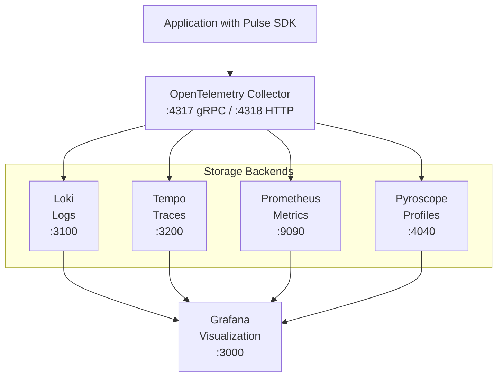

# Pulse Observability Stack

Complete observability stack for Pulse applications with logging, tracing, metrics, and profiling.

## Services

- **Loki** - Log aggregation system
- **Tempo** - Distributed tracing backend
- **Prometheus** - Metrics collection and storage
- **Pyroscope** - Continuous profiling platform
- **OpenTelemetry Collector** - Telemetry data pipeline
- **Grafana** - Unified observability dashboard

## Architecture



## Installation

### Prerequisites
- Docker
- Docker Compose
- Git

## Usage

### Start the Observability Stack

```bash
cd docker
docker compose up -d
```

This will start all services with health checks. Wait for all services to be healthy:

```bash
docker compose ps
```

### Access Services

- **Grafana**: http://localhost:3000 (no login required)
- **Loki**: http://localhost:3100
- **Tempo**: http://localhost:3200
- **Prometheus**: http://localhost:9090
- **Pyroscope**: http://localhost:4040
- **OTEL Collector**: http://localhost:4317 (gRPC), http://localhost:4318 (HTTP)

### Pre-configured Datasources

All datasources are automatically configured in Grafana:
- **Loki** - Logs with trace correlation
- **Tempo** - Distributed tracing with log/metric correlation
- **Prometheus** - Metrics
- **Pyroscope** - Continuous profiling

### Running Examples

#### MCAP Logging Example
```bash
cd examples/mcap
go run main.go
```

#### Profiling Example
```bash
cd examples/profiling
go run main.go
```

Then view:
- Logs in Grafana → Explore → Loki
- Profiles in Grafana → Explore → Pyroscope or http://localhost:4040

### Stop the Stack

```bash
docker compose down
```

To remove volumes:
```bash
docker compose down -v
```

## Contributing

We welcome contributions! Pulse is open-source and maintained by Machani Robotics.

1. Fork the repository
2. Create a feature branch
3. Make your changes
4. Submit a pull request

## License

Copyright © 2025 Machani Robotics

Licensed under the Apache License, Version 2.0.
